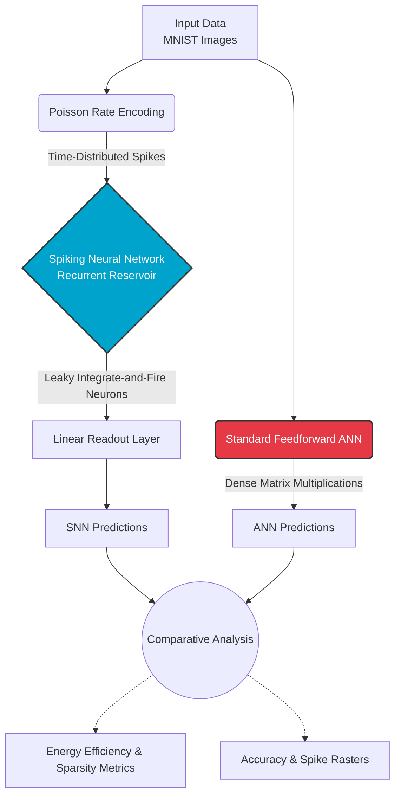

# SiliconDish-Brain: Code Contents and Informatics

Welcome to the official repository for the **SiliconDish-Brain** framework! This repository contains the in-silico experimentation code for our research on biologically inspired Spiking Neural Networks (SNNs) and their energy efficiency compared to standard Artificial Neural Networks (ANNs).

## 📁 Repository Structure

*   `mnist_snn_vs_ann.py`: Our initial implementation comparing a basic Reservoir-based SNN against a standard feedforward ANN on the MNIST dataset.
*   `mnist_revamped.py`: The hyperparameter-tuned version of our SNN, which drastically improves accuracy (up to 92.2%) while maintaining massive energy efficiency gains.
*   `Image Informatics/`: A directory containing the high-resolution vector outputs (PDFs) generated by our framework, including:
    *   **Accuracy Progressions** & **Confusion Matrices**
    *   **Energy Sparsity Comparisons** (proving event-driven computing saves power)
    *   **Reservoir Spike Rasters** (visualizing the actual firing of LIF neurons)

## 🧠 System Architecture

The following diagram outlines the theoretical and computational workflow of the *SiliconDish-Brain* framework for the MNIST benchmarking tasks provided in this repository.

## ⚙️ Key Mechanisms Highlighted
*   **Poisson Rate Encoding:** Bridging the gap between static digital images and biological temporal events.
*   **Computational Sparsity:** Proving that zero-valued pixels result in zero spikes, thereby consuming zero energy (a massive advantage over standard dense MAC operations).
*   **Liquid State Machine (LSM):** Utilizing a fixed recurrent SNN reservoir for temporal dynamic processing.
